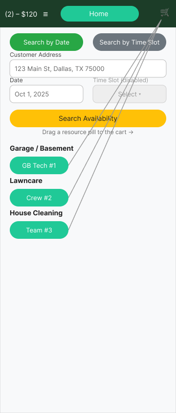
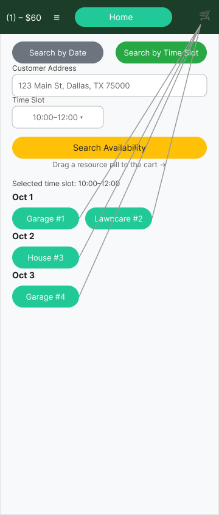

# Tucker and Dale's Home Services
## 📇 Customers App (Phase 1)

The **Customers app** provides a reusable pattern for managing core business data in a Django project.  
It implements **full CRUD (Create, Read, Update, Delete)** operations with a mobile-first, responsive UI.

### 🔑 Features
- Superuser-only access (owner-facing app).
- Customer search by name, address, or email.
- Pagination with "Showing X–Y of Z results" for clarity.
- Mobile-first layout, optimized for 360px screens and up.
- Custom global styling system with CSS variables for consistent theming.
- Reusable confirmation modal for destructive actions (delete).
- Extensible templates and views.

### ♻️ Reusability
This app was built as a **blueprint for future apps** (Scheduling, Employees, Inventory).  
Key reusable elements include:
- **Model + Form pattern** with validation.  
- **Search + pagination logic** for large datasets.  
- **Mobile-first templates** that adapt across phases.  
- **Global CSS variables** for consistent design across apps.  
- **CRUD workflow with confirmation modals**.  

By following this pattern, future apps (e.g., Employees, Scheduling, Inventory) can be quickly wired up using the same structure.

### 🚀 How to Wire Into Another Project
1. Add `customers` to your `INSTALLED_APPS` in `settings.py`.
2. Include the app’s URLs:
   ```python
   path("customers/", include("customers.urls")),

## 🖼️ Wireframes

Wireframes were created during the UX design phase to validate layout and navigation before coding.  
Each wireframe below corresponds to a key page in the **Customers App (Phase 1)**.  

---

## Wireframes (Phase 1)

Wireframes were created during the UX design phase to validate layout and navigation before coding.  
Each wireframe corresponds to a core page.

- **Home / Navbar Mobile 360x844**  
  ### 

  ### 

- **Customer List**  
  

- **Customer Detail**  
  

- **Customer Form**  
  

- **Delete Confirmation Modal**  
  

---

## Responsive Design Considerations (Phase 1)

**Navigation**  
- Mobile: collapsible hamburger  
- Tablet/Desktop: expanded navbar  

**Cards & Forms**  
- Mobile: single column  
- Tablet/Desktop: multi-column layout  

**Modals**  
- Keyboard accessible; scale to viewport  

**Pagination**  
- Centered; wraps on small screens  

---

## Entity–Relationship Diagrams (Phase 1)

The ERDs document the **data model design** used in Phase 1.

- **RegisteredCustomer Model**
  
  

---

## Scheduling App (Phase 2)

Customer-facing scheduling with **resource-aware availability**, **drag-and-drop booking**, and a **mini cart**.

### Features
- **Two search modes (mutually exclusive):**
  - **Search by Date** → Show all time slots for that day.
  - **Search by Time Slot** → Show all dates where that slot has available resources.
- **Service Categories:** Garage/Basement, Lawncare, House Cleaning.
- **Resource pills per slot** (e.g., 5 employees → 5 pill buttons).
- **Travel adjacency logic:** show resources only if their jobs in adjacent slots are within ~30 minutes drive.
- **Drag & Drop to Cart:** resource pills dragged into cart; slot dims or hides when booked.
- **Mini Cart (always visible):** shows item count and total $; expandable with hamburger for itemized list and checkout.
- **Login/Signup required** to complete checkout and save purchase history.

### Reusability
- **Calendar grid** reusable across services.  
- **Availability filter logic** (time + travel distance).  
- **Drag-and-drop cart** reusable for other booking flows.  
- **CSS variables** for consistent theme.  

### How to Wire Into Another Project
1. Add `scheduling` to `INSTALLED_APPS`.  
2. Include URLs in your project’s `urls.py`:
   ```python
   from django.urls import path, include

   urlpatterns = [
      
       path("schedule/", include("scheduling.urls")),
   ]

## 🖼️ Wireframes (Phase 2)

Wireframes were created during the UX design phase to validate layout, search methods, and booking flow before coding.  
Each wireframe corresponds to a key customer-facing screen.

- **Wireframe A — Search by Date (Mobile 360×844)**

  

- **Wireframe B — Search by Time Slot (Mobile 360×844)**

  

---

## 📱 Responsive Design Considerations (Phase 2)

**Mobile (360px)**  
- Stacked day cards with resource pills and sticky mini-cart (quantity + total).  
- Mutually exclusive search toggles (Date vs Time Slot); only one active at a time.  
- Drag-and-drop affordances with arrows/cues targeting the cart.

**Tablet (≥768px)**  
- Two-column day layout with more room for filters/inputs.  
- Mini-cart remains visible; itemized view via hamburger control.

**Desktop (≥1200px)**  
- Multi-column grid (week or multi-day view).  
- Persistent cart sidebar for summary + checkout.

---

## 🗂️ Entity–Relationship Diagrams (Phase 2)

The ERDs document the **data model design** used in Phase 2.

- **Employees / ServiceCategory / Skills**  
  

- **Booking / TimeSlot / Availability / CartItem**  
  

- **Customer Profile (online accounts)**  
  

## Credits
hero.png from https://www.moviepilot.de/movies/tucker-dale-vs-evil/bilder/374767